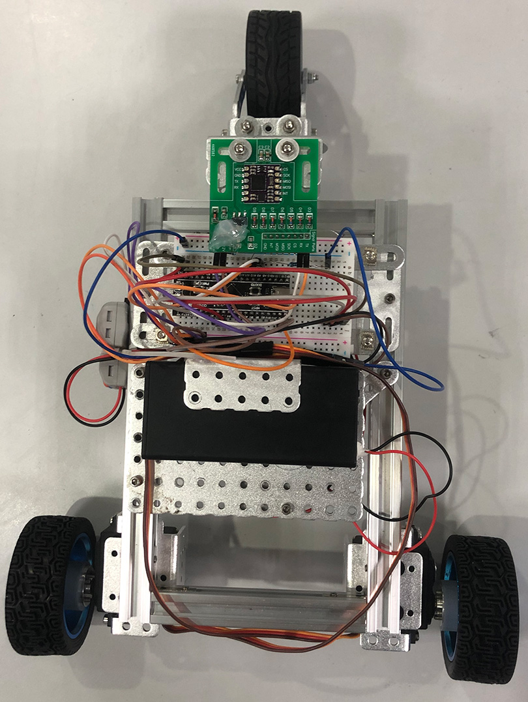
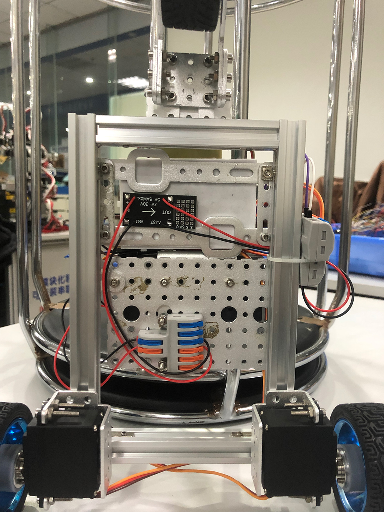
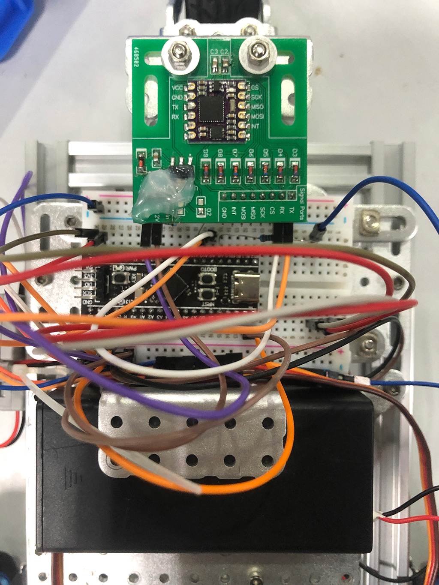
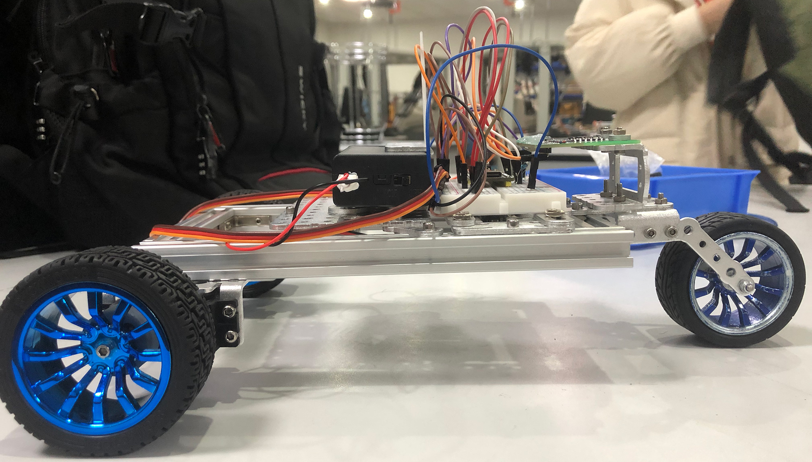

   
  <h2>stm32-seesaw</h2>
  基于HAL库的stm32机器人跷跷板项目  

### 硬件构成
小车为三轮，车身由铝合金框架连接构成，在其上固定有面包板，用杜邦线连接单片机、电机、蓝牙模块、电池盒与传感器，同时用扎线带等固定好分线器（位于侧面与底部）与电源模块（位于底部），具体实物图如下。

<table>
	<tr>
		<td>上面</td>
		<td>底面</td>
        <td>核心</td>
	</tr>
</table>
<table>
	<tr>
		<td>侧面</td>
	</tr>
</table>

