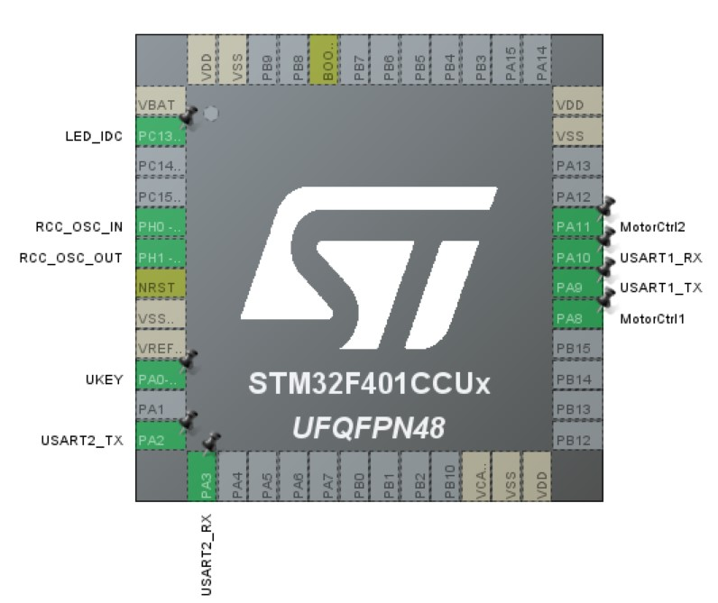
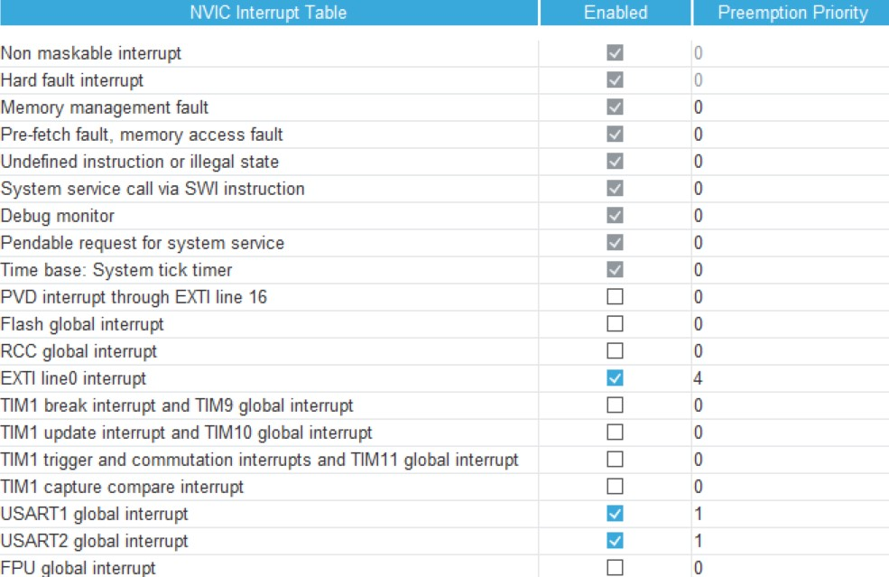
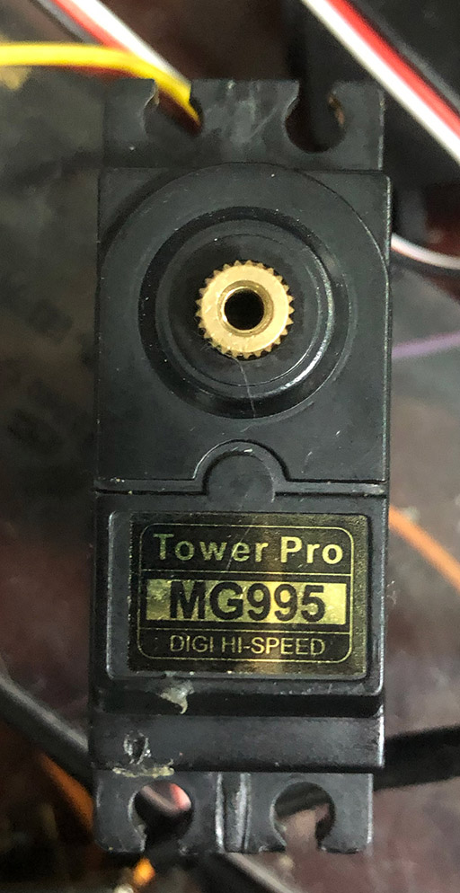
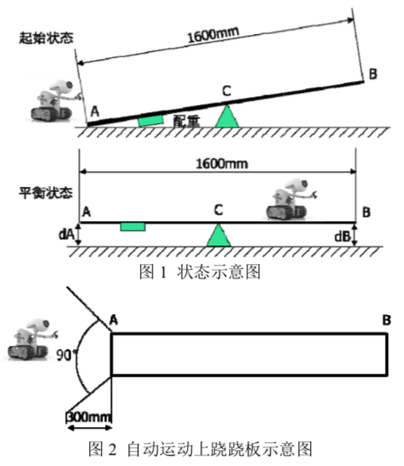

   
  <h1>stm32-seesaw</h1>
  基于HAL库的stm32机器人跷跷板项目  

## 开发流程
首先使用`STM32 Cude MX`生成带`Makefile`的HAL库工程模版，然后修改`Core`文件夹下的用户代码，使用`make`命令编译，在`build`目录即可获得`seesaw.elf`等文件，接下来按下`BOOT0+RESET`使单片机进入下载模式，使用usb将其连接到电脑，用`STM32 Cube Programmer`将编译好的程序烧录进单片机。

## 硬件架构
小车为三轮，车身由铝合金框架连接构成，在其上固定有面包板，用杜邦线连接单片机、电机、蓝牙模块、电池盒与传感器，同时用扎线带等固定好分线器（位于侧面与底部）与电源模块（位于底部），具体实物图与分模块说明如下。

<table>
	<tr>
		<td align="center"></td>
		<td align="center"></td>
        <td align="center"></td>
	</tr>
    <tr>
		<td align="center">上面</td>
		<td align="center">底面</td>
        <td align="center">核心</td>
	</tr>
</table>
<table>
	<tr>
		<td align="center"></td>
	</tr>
    <tr>
		<td align="center">侧面</td>
	</tr>
</table>

### 1. 单片机
单片机型号为`STM32F401CCUx`，具体实物如上图。定义其引脚与中断如下，详细可见`seesaw.ioc`，该文件可用`STM32 Cude MX`打开。

### 2. 电机
电机型号为`MG995`，使用单片机`TIM1`产生的`PWM`波驱动，实物图如下。

### 3. 传感器
传感器为九轴传感器`GY953`，通过`UART1`与单片机通信，具有加速度、角加速度、欧拉角，磁场的测量功能，并且还可以以固定频率（默认`50Hz`）输出数据，具体使用文档可以在网络上找到，不再赘述。项目中只使用了角加速度与欧拉角，并使用其固定频率作为外部时钟中断。

### 4. 蓝牙模块
蓝牙模块作为调试使用，通过`UART2`与单片机通信，在调试完毕后可以移除。

### 5. 电源模块
电源模块位于小车底部，提供恒定的`5V`电压源。不过当电机转速突变时，其将产生约`9V`的尖峰，可能会导致系统工作失常。本项目的代码通过避免速度突变使系统工作正常，不过也可通过加入电容调节。

## 软件架构
本项目通过代码控制小车实现了以下一系列动作：
1. 上电，标定正确航向（约 3s），成功后 LED 灭
2. 在跷跷板为圆心 90° 扇形范围内，距离跷跷板 A 端 300mm 以外指定位置放置，按动 UKEY 启动，LED 亮，小车自主运动上跷跷板
3. 在 60s 内，运动到中心点 C 附近
4. 到达跷跷板左倾与右倾的欧拉角 pitch 极值点，通过平均计算出中点处 pitch 值
5. 以中点处 pitch 值运行 PID 算法，使跷跷板处于平衡状态，然后保持平衡 10s ，并给出明显的平衡指示（LED 闪烁）
6.  60s 内回到 A 端，并给出明显的到达指示（LED 闪烁）

程序完全采用中断驱动，在主函数中初始化电机、传感器等外设后，即在`while (1)`中使用`__WFI()`等待中断到来，处理相应事件。

### 1. UART1 传感器中断
频率为`50Hz`，是主要的中断源。程序的主体都在该中断下完成，中断优先级为`1`。

### 2. UKEY 按键中断
通过按下按键启动自主程序，是仅使用一次的重要中断，中断优先级为`4`。

### 3. 系统时钟中断
是`HAL_Delay()`函数用到的中断，必须在最高中断优先级`0`，否则程序将会在中断处理时死锁。